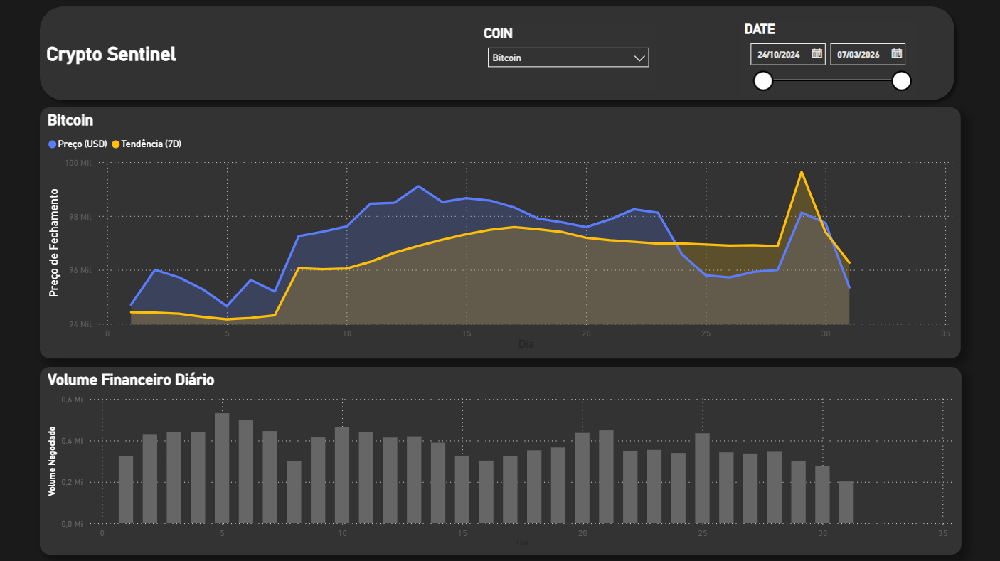

# Crypto Sentinel: Data Pipeline 

**[EN]** Analysis of volatility and trends of high-liquidity assets (BTC, ETH, SOL) using a professional data engineering architecture.
**[PT]** Análise de volatilidade e tendências de ativos de alta liquidez (BTC, ETH, SOL) utilizando uma arquitetura profissional de engenharia de dados.

---

## 📌 Project Overview | Visão Geral do Projeto

**[EN]**
Crypto Sentinel is a data engineering pipeline designed to monitor and analyze high-liquidity digital assets. Using a Medallion Architecture, the project ensures data integrity from raw ingestion to business-ready analytics. It demonstrates skills in API integration, data cleaning with Pandas, and dimensional modeling.

**[PT]**
O Crypto Sentinel é um pipeline de engenharia de dados projetado para monitorar e analisar ativos digitais de alta liquidez. Utilizando a Arquitetura de Medalhão, o projeto garante a integridade dos dados desde a ingestão bruta até a análise pronta para o negócio. Demonstra competências em integração de APIs, limpeza de dados com Pandas e modelagem dimensional.

## 🏗️ Architecture | Arquitetura

**[EN]** The project follows the **Medallion Architecture** pattern, dividing data processing into three logical layers to ensure data quality and lineage.

**[PT]** O projeto segue o padrão de **Arquitetura de Medalhão**, dividindo o processamento em três camadas lógicas para garantir a qualidade e linhagem dos dados.

### 📂 Pipeline Stages | Etapas do Pipeline

* **Bronze (Raw):** * **[EN]** Immutable raw data ingestion from CCXT API stored in JSON format.
  
    * **[PT]** Ingestão de dados brutos imutáveis da API CCXT, salvos em formato JSON.
      
* **Silver (Cleaned):** * **[EN]** Data cleaning, timestamp normalization, and technical indicator calculations (Moving Averages, Volatility) using Python/Pandas.
  
    * **[PT]** Limpeza de dados, normalização de timestamps e cálculo de indicadores técnicos (Médias Móveis, Volatilidade) usando Python/Pandas.
      
* **Gold (Business):** * **[EN]** The Gold layer implements a Star Schema model, centralizing historical metrics in a Fact table connected to descriptive Dimensions for optimized Power BI performance.
  
**[PT]** A camada Gold implementa um modelo Star Schema, centralizando métricas históricas em uma tabela Fato conectada a Dimensões descritivas para performance otimizada no Power BI.

## 🛠️ Technologies | Tecnologias

* **Language:** Python 3.10+
* **Data Library:** Pandas, PyArrow
* **API Integration:** CCXT (Cryptocurrency eXchange Trading Library)
* **Storage Format:** Apache Parquet (Columnar Storage)
* **Visualization:** Power BI

## 🚀 How to Run | Como Rodar

1. **Clone the repository | Clone o repositório:**

2. **Install dependencies | Instale as dependências:**

Bash
pip install pandas ccxt pyarrow

3. **Execute the pipeline | Execute o pipeline:**
[EN] Run the orchestrator to process all layers (Bronze -> Silver -> Gold) at once:
[PT] Rode o orquestrador para processar todas as camadas (Bronze -> Silver -> Gold) de uma vez:

Bash
python main.py

4. **Visualize in Power BI | Visualize no Power BI:**
**[EN]** Open the .pbix file in the reports/ folder and update the data source to your local data/gold path.
**[PT]** Abra o arquivo .pbix na pasta reports/ e atualize a fonte de dados para o caminho local da sua pasta data/gold.

## 📊 Final Results | Resultados Finais
**[EN]** The final dashboard provides a clear view of price trends against the 7-day moving average and financial volume distribution.
**[PT]** O dashboard final fornece uma visão clara das tendências de preço contra a média móvel de 7 dias e a distribuição de volume financeiro.

## 🏆 Conclusion & Project Value | Conclusão e Valor
**[EN]** This project demonstrates a robust data engineering solution. By implementing a Star Schema in the Gold layer, we ensure that business logic is decoupled from raw data, allowing for high-performance analytical queries. This architecture is designed for scalability, enabling the addition of new assets with minimal code changes.

**[PT]** Este projeto demonstra uma solução robusta de engenharia de dados. Ao implementar um Star Schema na camada Gold, garantimos que a lógica de negócio seja separada dos dados brutos, permitindo consultas analíticas de alta performance. Esta arquitetura foi projetada para ser escalável, permitindo a adição de novos ativos com alterações mínimas no código.

---
*Developed as a Portfolio Project for Data Engineering.*
