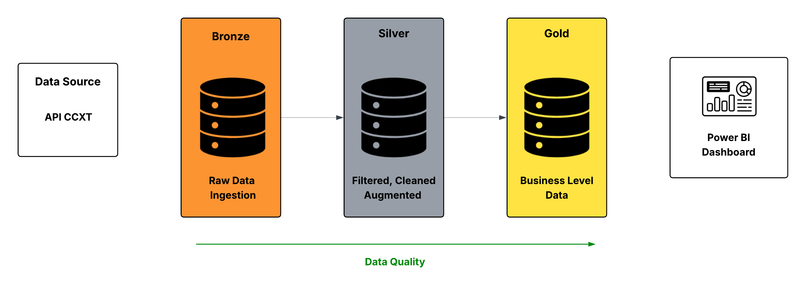

# Crypto Sentinel: Data Pipeline 

**[EN]** Analysis of volatility and trends of high-liquidity assets (BTC, ETH, SOL) using a professional data engineering architecture.
**[PT]** Análise de volatilidade e tendências de ativos de alta liquidez (BTC, ETH, SOL) utilizando uma arquitetura profissional de engenharia de dados.

---

## 📌 Project Overview | Visão Geral do Projeto

**[EN]**
Crypto Sentinel is a data engineering pipeline designed to monitor and analyze high-liquidity digital assets. Using a Medallion Architecture, the project ensures data integrity from raw ingestion to business-ready analytics. It demonstrates skills in API integration, data cleaning with Pandas, and dimensional modeling.

**[PT]**
O Crypto Sentinel é um pipeline de engenharia de dados projetado para monitorar e analisar ativos digitais de alta liquidez. Utilizando a Arquitetura de Medalhão, o projeto garante a integridade dos dados desde a ingestão bruta até a análise pronta para o negócio. Demonstra competências em integração de APIs, limpeza de dados com Pandas e modelagem dimensional.

## 🏗️ Architecture | Arquitetura

**[EN]** The project follows the **Medallion Architecture** pattern, dividing data processing into three logical layers to ensure data quality and lineage.
**[PT]** O projeto segue o padrão de **Arquitetura de Medalhão**, dividindo o processamento em três camadas lógicas para garantir a qualidade e linhagem dos dados.

### 📂 Pipeline Stages | Etapas do Pipeline

* **Bronze (Raw):** * **[EN]** Immutable raw data ingestion from CCXT API stored in JSON format.
    * **[PT]** Ingestão de dados brutos imutáveis da API CCXT, salvos em formato JSON.
* **Silver (Cleaned):** * **[EN]** Data cleaning, timestamp normalization, and technical indicator calculations (Moving Averages, Volatility) using Python/Pandas.
    * **[PT]** Limpeza de dados, normalização de timestamps e cálculo de indicadores técnicos (Médias Móveis, Volatilidade) usando Python/Pandas.
* **Gold (Business):** * **[EN]** Star Schema dimensional modeling optimized for analytical consumption and Power BI dashboards.
    * **[PT]** Modelagem dimensional Star Schema otimizada para consumo analítico e dashboards no Power BI.

## 🛠️ Technologies | Tecnologias

* **Language:** Python 3.10+
* **Data Library:** Pandas
* **API Integration:** CCXT (Cryptocurrency eXchange Trading Library)
* **Environment:** Dotenv (Security)
* **Visualization:** Power BI

---
*Developed as a Portfolio Project for Data Engineering.*
